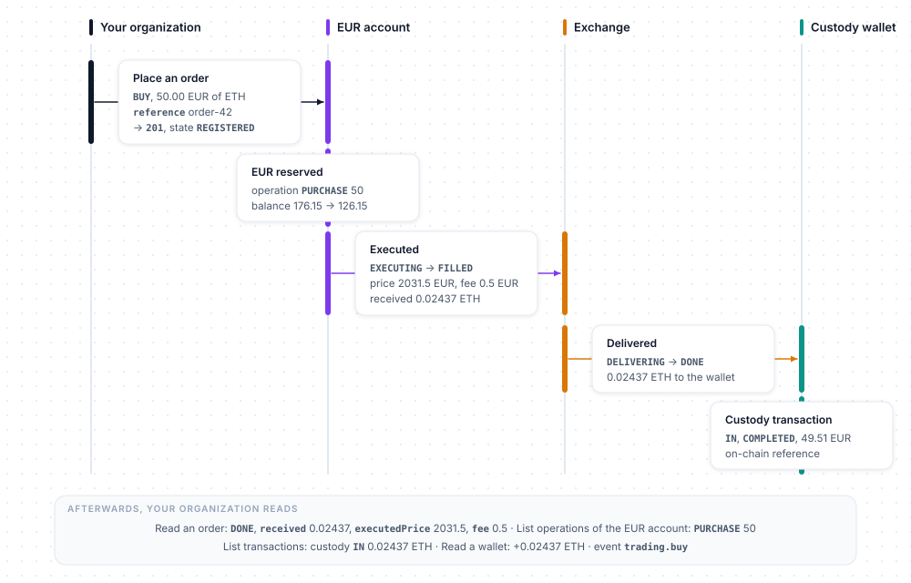
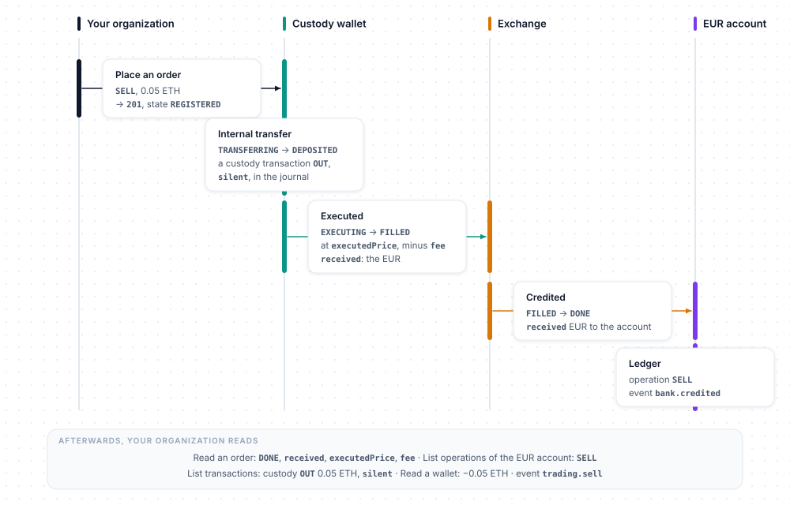

# Concepts

The conventions shared by every resource of the SDK: how a customer is designated, how amounts, pages, booleans, assets and dates travel, and which customers the financial resources accept. Examples use `client`, a configured `BitgenClient` ([Configuration](configuration.md)), and `customer`, the `Created` returned by `client.customer.create()`.

## User references

Wherever a method expects a customer, its signature says `UserRef` — a type alias of `bitgen.models`: `str | Created | Customer | Account | UserSummary | OrderUser`. A string is the customer's **uuid**; a model is one that carries it. The SDK sends the uuid of the model: the `Created` returned by `client.customer.create()`, a `Customer` of `client.customer.list()`, an `Account` of `client.customer.get()`, the `user` of an `Order`, the `owner` of a `Transaction` or of a `StakingMovement`.

```python
account = client.bank.get("CUSTOMER_UUID")
account = client.bank.get(customer)  # the Created returned by client.customer.create()
```

Any other object — a `Wallet`, an `Order`, a dict with a `uuid` — is a `TypeError` at the call, before any request. An email works too where the API resolves it (`customer`, `bank`, `custody`, `staking` — not `trading`, nor the `user` filter of the lists), but the uuid is cheaper for the API — prefer it.

The same goes for the other objects the SDK returns: wherever a method expects the uuid of an order, a movement, a position, a connector, a transaction, a subscription, an event of the catalogue or a key, it also takes the model itself (`client.staking.rewards(movement.staking)`, `client.trading.get(order)`), and sends its uuid.

## Amounts

The API handles crypto amounts as **strings** (up to 18 decimals): a Python `float` only keeps about 15 significant digits and nothing on the server side restores what it lost. The SDK therefore:

- accepts a `str`, an `int`, a `float` or a `Decimal` and always sends it as a string — a string is sent as is, an `int` or a `float` in its shortest decimal form, a `Decimal` in plain notation;
- refuses, with a `ValueError` and before any request, an empty string, a negative or non-finite number, and a `float` Python would write in exponent notation — below `0.0001` or from `1e16`: pass those as strings or as `Decimal`;
- never rounds or reformats a string: `"0.000000000000000001"` reaches the API untouched.

**Prefer strings or `Decimal`**, even for EUR: `0.1 + 0.2` is `0.30000000000000004` as a `float`. In responses, crypto quantities are strings and EUR amounts are `float`s with 2 decimals.

**Minimums.** Purchases, sales, on-chain withdrawals and staking movements have minimums — set by BITGEN per environment, subject to change, never hard-coded in the SDK. The API's answer is the source of truth: `416 invalid_amount` for a purchase or a sale, `416 withdraw_below_minimum` for an on-chain withdrawal, `422 amount_below_minimum` for a staking movement. For staking, the provider's minimums are readable in its configuration (`client.staking.providers()`, [Staking](resource/staking.md#providers)).

## Pagination

Paginated lists take `offset` and `limit` (`limit`: default 10, max 50; the transaction journal accepts up to 100) and return a `bitgen.Page`:

```python
page = client.asset.list()

page.count  # the total number of items
page.items  # the items of this page, typed models — Page[models.Asset] here
```

`Page[T]` is generic: `page.items` is a `list[T]`, and a type checker knows what each item is.

## Query booleans

The boolean filters of the lists (`includeClosed`, `includeRevoked`, `includeArchived`) are sent as `true` / `false`. The API also reads `1` / `0`, treats an absent parameter as `false`, and answers `422 invalid_<param>` for any other value: `invalid_include_closed`, `invalid_include_revoked`, `invalid_include_archived`.

## Assets

Wherever an asset is expected, the SDK accepts its **uuid** or its **ISO code** as a string, in any case (the API normalizes it) — or an `Asset` / `AssetRef` model returned by the SDK, whose uuid is then sent. The `bitgen.Asset` constants are the ISO codes of the main assets; any other code known to the catalogue ([Assets](resource/asset.md)) is passed as a plain string.

```python
from bitgen import Asset

Asset.BTC  # "btc"
Asset.ETH  # "eth"
Asset.USDC  # "usdc"
Asset.XRP  # "xrp"
Asset.SOL  # "sol"
Asset.VALUES  # ("btc", "eth", "usdc", "xrp", "sol")

eth = client.asset.get(Asset.ETH)  # or by uuid
wallet = client.custody.wallet(customer, eth)  # the model: its uuid is sent
```

The `iso` the API returns has the case it is stored with (`ETH` today): **compare it case-insensitively**. `bitgen.Asset` holds the ISO codes; the asset returned by `client.asset` is the `bitgen.models.Asset` model.

## Constants

The SDK has no enums: every value the API enumerates is a **string constant** on a small class — `Env.SANDBOX` is `"sandbox"`, `Locale.FR` is `"FR"`, `TradingDirection.BUY` is `"buy"`, `AssetState.AVAILABLE` is `"AVAILABLE"`, `WebhookEventName.CUSTODY_SENT` is `"custody.sent"` — and each class lists its values in `VALUES`, in the order of the API. The classes of the values a model carries live under `bitgen.models`, next to the model.

```python
from bitgen import Asset
from bitgen.models import AssetState, Locale

eth = client.asset.get(Asset.ETH)
if eth.state == AssetState.AVAILABLE:  # outputs are strings: compare them with the constants
    client.customer.update(customer, locale=Locale.EN)  # inputs take the constant
print(", ".join(Locale.VALUES))  # FR, EN
```

An input that is not one of the values (`locale="en"`, `direction="Buy"`) is refused with a `ValueError` before any request: the case matters. An output the SDK does not know yet (a state the API added) is kept as is, as a string. The constants cannot be changed or instantiated.

## Timestamps and histories

Timestamps are **epochs in seconds** (`createdAt`, `updatedAt`, `date`, `expiresAt`…). Time series are a `bitgen.models.History` with five lists of points, `d`, `w`, `m`, `y` and `all`:

```python
from datetime import UTC, datetime

from bitgen import Asset

btc = client.asset.ticker(Asset.BTC)

for epoch, price in btc.history.d:  # the last 24 hours, one point per hour
    print(datetime.fromtimestamp(epoch, tz=UTC).strftime("%H:%M"), price)
```

Each point is a tuple `(epoch seconds, value)`: `d` covers the last 24 hours with one point per hour, `w` and `m` one point per day, `y` and `all` one point per month; the last point is the current value. Histories are the EUR price of an asset (`client.asset`), the EUR balance of a bank account (`client.bank`), the EUR value of a wallet or of a whole custody (`client.custody`), and the capital and revenues of a staking portfolio (`client.staking`).

## Activation and identity

By default, creating a customer sends them an activation email. Until they click it, the account stays `CREATED` and the **financial resources do not see it**: the bank answers `404 unknown_bank`, custody and staking `403 org_forbidden`, trading `403 user_not_in_scope`. Only the customer resource sees it (where the customer appears as `CREATED`). An organization that handles onboarding itself creates its customers with `needActivation=False` — usable right away, no BITGEN email — and `notify=False` for no BITGEN emails at all.

If your organization uses BITGEN's identity verification, the customer's identity (KYC for a person, KYB for a business) must be validated first — `412 owner_identity_not_validated` when reading the EUR account, `403 kyc_not_validated` on custody, trading and staking otherwise. An organization that verifies the identity of its customers by its own means has no such requirement. The verification itself is not part of the SDK; its state is the `state` of the customer's identity.


## Following a purchase and a sale

A purchase moves money across four resources. Placing the order reserves the EUR on the customer's bank account — an operation `PURCHASE` ([Bank accounts](resource/bank.md)); the exchange of the platform executes it — `EXECUTING`, then `FILLED` with the price, the fee and the quantity received ([Trading](resource/trading.md)); the quantity is delivered to the customer's custody wallet — `DELIVERING`, then `DONE` ([Custody wallets](resource/custody.md)) — where it appears as a custody transaction `IN` ([Transactions](resource/transaction.md)). Afterwards, the order carries the result, the operations of the bank account show the debit, the journal the delivery, the wallet its new balance, and the event `trading.buy` is sent ([Webhooks](resource/webhooks.md)).



A sale goes the other way. The quantity leaves the customer's custody wallet through an internal transfer to the exchange — a `silent` custody transaction `OUT` in the journal ([Custody wallets](resource/custody.md), [Transactions](resource/transaction.md)); the exchange executes it — `EXECUTING`, then `FILLED` at `executedPrice`, minus `fee` ([Trading](resource/trading.md)); the EUR received are credited on the customer's EUR account — `DONE`, an operation `SELL` and the event `bank.credited` ([Bank accounts](resource/bank.md)); the event `trading.sell` is sent ([Webhooks](resource/webhooks.md)).



## Following a deposit and a withdrawal

The EUR of a customer are held by the bank provider of your organization, on the organization's account — one IBAN, the same for all your customers, that you give them yourself. BITGEN holds no funds: it keeps the **ledger** of each customer — `balance`, `pending`, `history`, operations ([Bank accounts](resource/bank.md)). The provider receives the wires and pays the withdrawals; you read the ledger and receive the events ([Webhooks](resource/webhooks.md)).


A deposit: the customer wires EUR to the organization's account with the reference `BTGN` followed by the code of their account (`message`) → the provider reports the wire to BITGEN — with a manual bank, you declare it ([credit](resource/bank.md#credit)) — on the sandbox test bank, that declaration is taken and reported back within seconds → BITGEN matches the reference and the amount enters `pending.in_` → compliance analysis: a `BANK` `IN` transaction, `bank.transaction` (`PENDING` if an alert holds it — [Transactions](resource/transaction.md)) → `balance` credited, operation `DEPOSIT`, `bank.credited`. The credit is never immediate; without a valid reference the wire is never credited, and the compliance of your organization is notified.


A withdrawal: you request it ([Withdraw](resource/bank.md#withdraw)) — the amount is reserved in `pending.out`, `balance` untouched, `transaction` identifies the withdrawal → compliance analysis, `bank.transaction` → the provider wires from the organization's account to the customer's IBAN → at confirmation, `balance` debited, operation `WITHDRAWAL`, `bank.debited` with `amount`, `fee` and `net`. If it fails, the reserve is released.
