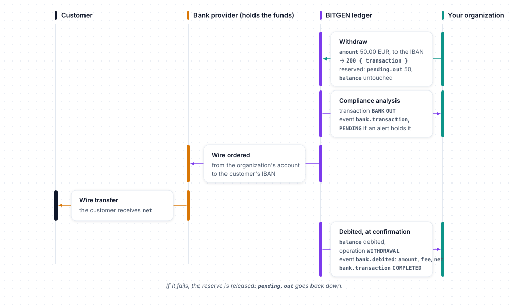

# Bank accounts

Every customer has an EUR account on the BITGEN platform: a **ledger** of the EUR they hold with the bank provider of your organization — the provider receives their bank transfers and pays their withdrawals to their IBAN, BITGEN keeps the account and notifies you ([Following a deposit and a withdrawal](../concepts.md#following-a-deposit-and-a-withdrawal)). The balance pays their purchases and is credited by their sales. `client.bank` reads the account and its operations, withdraws EUR, and declares deposits.

Examples use `client`, a configured `BitgenClient` ([Configuration](../configuration.md)), and `customer`, the `Created` returned by `client.customer.create()`. A customer is designated by a `UserRef`: their uuid, or a model carrying it ([User references](../concepts.md#user-references)). The customer must belong to your organization and be activated, otherwise the API answers `404 unknown_bank` ([Activation and identity](../concepts.md#activation-and-identity)).

## Methods

| Method | What it does | Returns |
|---|---|---|
| `get(user)` | Reads the EUR account of a customer — creates it on first read | `BankAccount` |
| `operations(user, ...)` | Lists the EUR operations of a customer | `Page[BankOperation]` |
| `withdraw(user, amount, ...)` | Withdraws EUR to the customer's IBAN | `BankWithdrawal` |
| `credit(amount, ...)` | Declares an EUR deposit received on a manual bank provider, or taken by a provider that reports it itself (empty `uuid`) | `Created` |

Models of this resource, under `bitgen.models`: `BankAccount`, `BankPending`, `BankOperation`, `BankWithdrawal`, `Created` — the constant class `BankDirection`, and the shared `History`.

## Get

```
client.bank.get(user: UserRef) -> BankAccount
```

The account is created on first read — if your organization uses BITGEN's identity verification, the customer's identity must be validated first ([Activation and identity](../concepts.md#activation-and-identity)). The `message` of the account is the reference the customer must indicate on their bank transfers.

```python
account = client.bank.get(customer)

# 1. Give the customer the reference to put on their wire transfer
print(account.message)  # BTGN-4242

# 2. Once the transfer is received, the balance is credited
print(account.balance)  # 150.0
print(account.pending.in_, account.pending.out)  # 0.0 0.0
```

Returns a `BankAccount`:

| Attribute | Description |
|---|---|
| `uuid` | The account |
| `message` | The wire transfer reference the customer must indicate (`BTGN` prefix) |
| `iban`, `bank`, `bic` | The customer's bank details, `None` until set — `withdraw` can set them |
| `balance` | EUR balance (`float`) |
| `pending` | `BankPending`: `in_` (reported deposits not credited yet — BITGEN processing and compliance analysis; `in` in the API, a reserved word in Python), `out` (withdrawals requested and purchase reserves, not settled yet) |
| `history` | EUR balance curve, a `History` ([Timestamps and histories](../concepts.md#timestamps-and-histories)) — `None` until the hourly computation has run for this account |

## Operations

```
client.bank.operations(user: UserRef, *, direction: str | None = None, from_: int | None = None, to: int | None = None, offset: int | None = None, limit: int | None = None) -> Page[BankOperation]
```

| Argument | Type | Description |
|---|---|---|
| `direction` | `str \| None` | `BankDirection.ALL` (default), `DEPOSIT`, `WITHDRAWAL`, `PURCHASE` or `SELL` — anything else is refused before any request |
| `from_`, `to` | `int \| None` | Epoch seconds; both together, otherwise ignored — `from_` because `from` is a reserved word in Python |
| `offset`, `limit` | `int \| None` | [Pagination](../concepts.md#pagination) |

```python
from bitgen.models import BankDirection

page = client.bank.operations(customer, direction=BankDirection.DEPOSIT, from_=1700000000, to=1702592000, limit=50)

for operation in page.items:
    print(operation.date, operation.direction, operation.amount)  # 1701000000 DEPOSIT 150.0
```

Returns a page of `BankOperation`: `txId` (identifier of the ledger entry), `amount` (EUR, `float`), `direction` (`BankDirection.DEPOSIT`, `WITHDRAWAL`, `PURCHASE` or `SELL` — a string), `date` (epoch seconds), `info` (free label of the operation — for instance the asset bought or sold — or `None`).

## Withdraw

```
client.bank.withdraw(user: UserRef, amount: str | int | float | Decimal, *, iban: str | None = None, bank: str | None = None, bic: str | None = None) -> BankWithdrawal
```

| Argument | Type | Description |
|---|---|---|
| `amount` | `str \| int \| float \| Decimal` | EUR, rounded to 2 decimals by the API ([Amounts](../concepts.md#amounts)) |
| `iban`, `bank`, `bic` | `str \| None` | Optional: update the customer's bank details before the withdrawal |

```python
withdrawal = client.bank.withdraw(
    customer, "50.00", iban="FR76…", bic="BNPAFRPP"
)  # the bank details are optional once set

print(withdrawal.transaction)  # the uuid of the transaction created for the withdrawal
```

The withdrawal goes to the customer's IBAN: the amount is reserved in `pending.out` and debited from the balance when the provider confirms the wire; the event `bank.debited` reports it then, with `amount`, `fee` and `net` — what the customer receives ([Following a deposit and a withdrawal](../concepts.md#following-a-deposit-and-a-withdrawal)). The account must have bank details (`412 bank_rib_required`), a sufficient balance (`416 requested_amount_error`) and an amount above the fee (`416 amount_below_fee`). Returns a `BankWithdrawal`: `transaction`, the identifier of the withdrawal — its `Transaction` in the journal ([Transactions](transaction.md)).



## Credit

```
client.bank.credit(amount: str | int | float | Decimal, *, user: UserRef | None = None, message: str | None = None, reference: str | None = None, currency: str | None = None) -> Created
```

`credit` only applies when your organization's bank provider is **manual** — deposits are not reported to BITGEN automatically: you tell BITGEN a wire has arrived on the organization's account. The amount enters `pending.in_`, goes through BITGEN's processing and the compliance analysis, and the account is credited then — `bank.credited` at that moment ([Following a deposit and a withdrawal](../concepts.md#following-a-deposit-and-a-withdrawal)). On a provider that **takes the declaration and reports the deposit itself** — the test bank of the sandbox environment — the call answers `201` with an empty body, no `uuid`: the incoming movement appears in `pending.in_` a second later, once the provider has reported it, and the `bank.transaction` / `bank.credited` events follow as for any deposit. With an automated provider that refuses declarations, deposits are detected and credited automatically and you are notified by the `bank.credited` webhook — do not call `credit`: the API refuses it (`412 deposit_reported_by_provider`). The account is designated either by the customer (`user`) or by the wire transfer reference of the account (`message`).

| Argument | Type | Description |
|---|---|---|
| `amount` | `str \| int \| float \| Decimal` | EUR ([Amounts](../concepts.md#amounts)) |
| `user` | `UserRef \| None` | The customer, by uuid or by model — or `message` |
| `message` | `str \| None` | The wire transfer reference of the account (`BTGN…`) — or `user` |
| `reference` | `str \| None` | The bank's transfer reference — it makes the call idempotent: calling twice with the same reference declares once (and returns the same `uuid`) |
| `currency` | `str \| None` | Optional, `EUR` |

```python
deposit = client.bank.credit(
    "100.00",
    user=customer,
    reference="BANK-TRANSFER-REF-42",  # the bank's transfer reference: credited once, however many times it is sent
)

print(deposit.uuid)
```

Returns a `Created`: the `uuid` of the declared deposit — the incoming movement, not credited yet. On a provider that reports the deposit itself (see above) `uuid` is `''`. Without `user` nor `message`, the API answers `400 bank_target_required`.


## Errors

In addition to the [common errors](../errors.md#common-errors):

| Status | `code` | Meaning |
|---|---|---|
| `400` | `invalid_amount` | The amount is not valid |
| `400` | `bank_target_required` | `credit` without `user` nor `message` |
| `400` | `invalid_currency` | `credit` with a currency other than `EUR` |
| `403` | `user_actions_disabled` | Customer actions are disabled for your organization (`user_can_actions` flag) |
| `404` | `unknown_bank` | The customer is not an activated member of your organization, or the account was not found |
| `404` | `unknown_organization` | `credit`: the organization is unknown |
| `412` | `owner_identity_not_validated` | Your organization uses BITGEN's identity verification and the customer's identity is not validated: the account cannot be created |
| `412` | `bank_rib_required` | `withdraw` without an IBAN or a bank on the account |
| `412` | `ramp_not_enabled` | The `RAMP` (bank) connector of your organization is not enabled |
| `412` | `deposit_reported_by_provider` | `credit` on an automated bank provider that refuses declarations: deposits are reported by the provider itself |
| `412` | `trading_not_enabled` | The `TRADING` connector of your organization is not enabled |
| `416` | `requested_amount_error` | Insufficient balance |
| `416` | `amount_below_fee` | The amount does not cover the fee |
| `422` | `invalid_iban` | The IBAN is not valid |
| `423` | `account_frozen` | The customer's account is frozen |
| `423` | `blocked_by_alert` | An active compliance alert blocks the customer |
| `423` | `bank_lock_unavailable` | The account is locked by a concurrent operation (creation, withdrawal) |

## Related

- [Following a deposit and a withdrawal](../concepts.md#following-a-deposit-and-a-withdrawal) — who holds the funds, what the ledger shows, when the events are sent
- [Amounts](../concepts.md#amounts) — EUR and crypto amounts, minimums
- [Customers](customer.md) — the customer the account belongs to
- [Trading](trading.md) — purchases paid from the EUR balance, sales credited to it
- [Transactions](transaction.md) — the journal where withdrawals appear
- [Webhooks](webhooks.md) — `bank.credited`, `bank.debited`, `bank.transaction`
