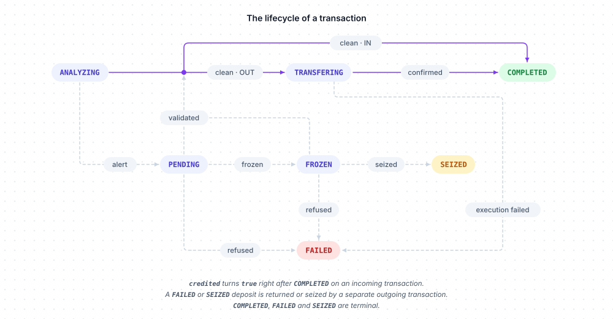

# Transactions

The transaction journal is the unified, read-only record of the fiat and crypto movements of your organization: bank deposits and withdrawals, custody deposits and withdrawals, and the internal legs of sales and staking. Transactions are created by the platform — never through the API — and referenced by the other resources: `client.bank.withdraw()` and `client.custody.withdraw()` return the uuid of the transaction they create. `client.transaction` lists and reads them.

Examples use `client`, a configured `BitgenClient` ([Configuration](../configuration.md)), and `customer`, the `Created` returned by `client.customer.create()`.



## Methods

| Method | What it does | Returns |
|---|---|---|
| `list(...)` | Lists the transactions of your organization | `Page[Transaction]` |
| `get(transaction)` | Reads one transaction, by uuid or reference | `Transaction` |

Models of this resource, under `bitgen.models`: `Transaction`, `TransactionAlert`, `UserSummary`, `UserSummaryAccount`, `OrganizationSummary`, `OrganizationHub` — and the constant classes `TransactionState`, `TransactionSource`, `TransactionDirection`.

## List

```
client.transaction.list(*, user: UserRef | None = None, status: str | None = None, source: str | None = None, direction: str | None = None, asset: str | models.Asset | AssetRef | None = None, offset: int | None = None, limit: int | None = None) -> Page[Transaction]
```

| Argument | Type | Description |
|---|---|---|
| `user` | `UserRef \| None` | Only the transactions of this customer (uuid or model; unknown → `404 unknown_user`) |
| `status` | `str \| None` | Only this state: `TransactionState.ANALYZING`, `PENDING`, `COMPLETED`, `FROZEN`, `FAILED`, `TRANSFERING` (the API's spelling) or `SEIZED` — anything else is refused before any request |
| `source` | `str \| None` | `TransactionSource.BANK` or `TransactionSource.CUSTODY` |
| `direction` | `str \| None` | `TransactionDirection.IN` or `TransactionDirection.OUT` |
| `asset` | `str \| models.Asset \| AssetRef \| None` | Only this asset, by ISO code, uuid or model |
| `offset`, `limit` | `int \| None` | [Pagination](../concepts.md#pagination) — `limit` up to 100 on this list |

```python
from bitgen import Asset
from bitgen.models import TransactionDirection, TransactionSource, TransactionState

page = client.transaction.list(
    user=customer,
    status=TransactionState.PENDING,
    source=TransactionSource.CUSTODY,
    direction=TransactionDirection.OUT,
    asset=Asset.ETH,
    offset=0,
    limit=100,
)

for transaction in page.items:
    print(transaction.direction, transaction.asset, transaction.amount, transaction.state)
```

Returns a page of `Transaction`.

## Get

```
client.transaction.get(transaction: str | Transaction) -> Transaction
```

`transaction` is the uuid of the transaction, its `reference`, or a `Transaction`.

```python
withdrawal = client.bank.withdraw(customer, "50.00")

transaction = client.transaction.get(withdrawal.transaction)
print(transaction.state)  # PENDING
```

Returns a `Transaction`:

| Property | Description |
|---|---|
| `uuid` | The transaction |
| `state` | `TransactionState.ANALYZING`, `PENDING`, `COMPLETED`, `FROZEN`, `FAILED`, `TRANSFERING` or `SEIZED` — a string; the cycle is below the table |
| `source` | `TransactionSource.BANK` (EUR) or `TransactionSource.CUSTODY` (crypto) — a string |
| `direction` | `TransactionDirection.IN` or `TransactionDirection.OUT` — a string |
| `asset` | The asset ISO code — `EUR` for a bank transaction |
| `amount` | The amount, in that asset (a `float` — for crypto, the exact amount is the string held by the custody wallet) |
| `eurValue` | EUR value when recorded, or `None` |
| `reference` | The reference, or `None` |
| `credited` | For an incoming transaction: `True` once the EUR account or the wallet has actually been credited, right after `COMPLETED` |
| `silent` | `True` for an internal leg (staking, sale) that is not an operation of the customer |
| `data` | Additional context set by the platform (compliance details, internal flags), a `dict` — varies with the transaction, not needed for an integration |
| `createdAt`, `updatedAt` | Epoch seconds |
| `owner` | The customer, a `UserSummary`: `uuid`, `state`, `login`, `account` (`UserSummaryAccount`: `firstname`, `lastname`, `fin`) — or `None` |
| `assignee` | The compliance officer assigned while the transaction is on hold (`PENDING`, `FROZEN`), a `UserSummary`; `None` otherwise |
| `organization` | `OrganizationSummary`: `uuid`, `state`, `name`, `hub` — the hub the organization belongs to (`OrganizationHub`: `uuid`, `name`, or `None`) — or `None` |
| `alert` | The compliance alert attached to the transaction (`TransactionAlert`), or `None`: `uuid`, `state` (`OPEN`, `RESOLVED`, `DISMISSED`, `DECLARATED`, `CONFIRMED`), `severity` (`SUCCESS`, `WARNING`, `CRITICAL`), `type` (`KYT`, `KYC_EXPIRE`, `SUSPICIOUS_ACTIVITY`, `AML`, `SANCTIONS`), `description`, `confidence` (confidence of the analysis, 0–100), `recommendation` (suggested action), `factors` (elements that weighed in the analysis), `sources` (the observations analysed), `history` (state changes of the alert), `incidentKey` (groups the alerts of a same incident), `createdAt`, `updatedAt`, `user` (the customer), `assignee` (the compliance officer), `organization` — `factors`, `history`, `user`, `assignee` and `organization` are kept as the API gives them (`Any`) |

An unknown uuid or reference, or a transaction outside your organization, answers `404 unknown_transaction`.

Every transaction is born `ANALYZING`, the compliance analysis — the internal legs too. A clean verdict sends an incoming transaction to `COMPLETED`, then the EUR account or the wallet is credited; an outgoing one to `TRANSFERING` — the wire or the on-chain send executes — then `COMPLETED` at its confirmation. An alert, or a crypto deposit on a frozen wallet, holds it in `PENDING`: an `alert` is attached and the compliance of your organization becomes the `assignee`. The compliance then freezes it (`PENDING` → `FROZEN`), validates it (`PENDING` or `FROZEN` → `COMPLETED` for an incoming transaction, `TRANSFERING` for an outgoing one; the alert is `RESOLVED`), refuses it (`PENDING` or `FROZEN` → `FAILED`) or seizes it (`FROZEN` → `SEIZED`); an execution that fails also ends `FAILED` (`TRANSFERING` → `FAILED`). `COMPLETED`, `FAILED` and `SEIZED` are terminal. A failed incoming transaction was never credited; a failed outgoing one releases its reserve or re-credits the wallet. Two exceptions appear in the list: a crypto deposit that failed on chain is recorded `FAILED` right away, and the return or the seizure of a refused or seized deposit is a separate outgoing transaction, born `TRANSFERING`. The internal legs (`silent`) go through the analysis like the others and send no event.

## Errors

In addition to the [common errors](../errors.md#common-errors):

| Status | `code` | Meaning |
|---|---|---|
| `400` | `invalid_transaction_state` | `status` is not one of the transaction states |
| `404` | `unknown_user` | `list`: unknown `user` |
| `404` | `unknown_asset` | `list`: unknown `asset` |
| `404` | `unknown_transaction` | Unknown uuid or reference, or outside your organization |

## Related

- [Bank accounts](bank.md) — EUR withdrawals return a transaction uuid
- [Custody wallets](custody.md) — on-chain withdrawals return a transaction uuid
- [Pagination](../concepts.md#pagination) — `limit` up to 100 on this list
- [Webhooks](webhooks.md) — `bank.transaction`, `custody.transaction`, `alert.opened`, `alert.status`
